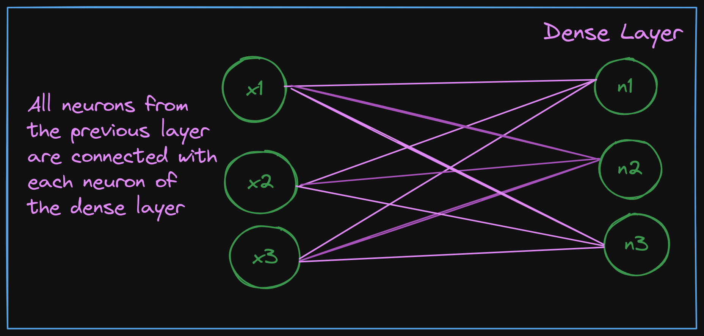
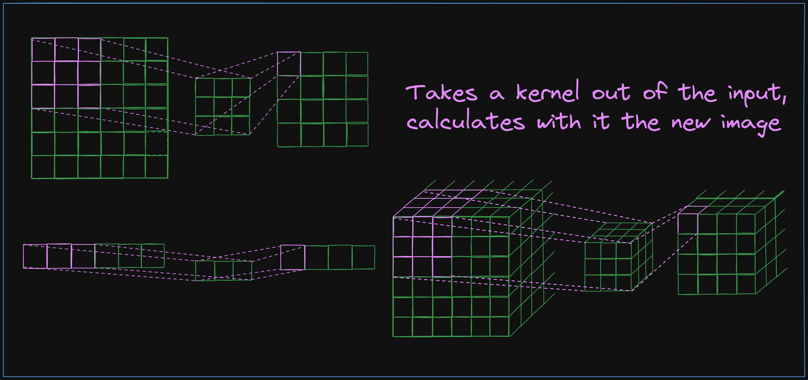
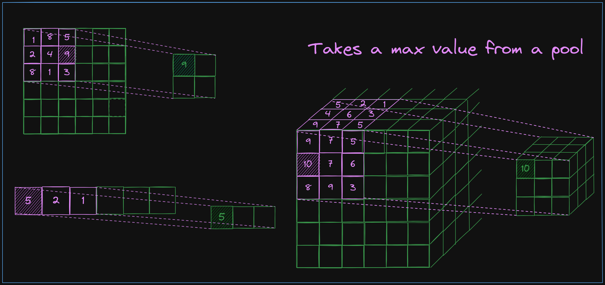
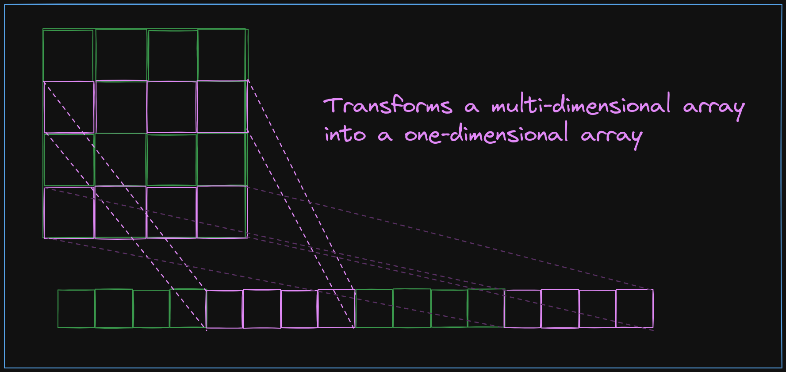
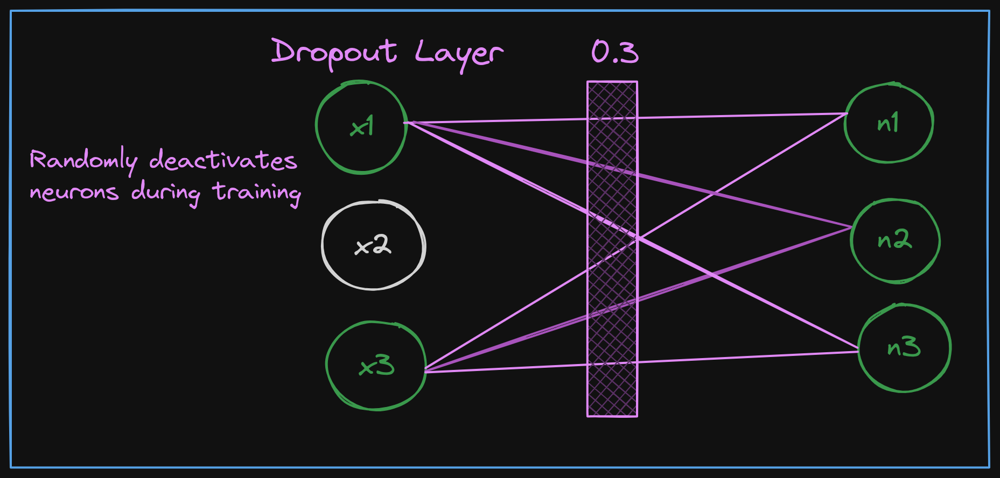
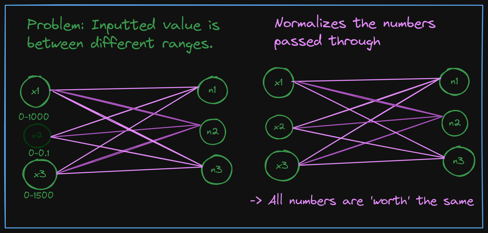
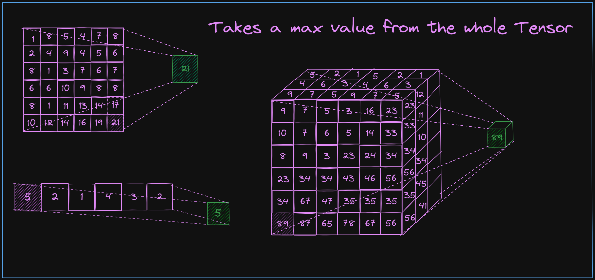
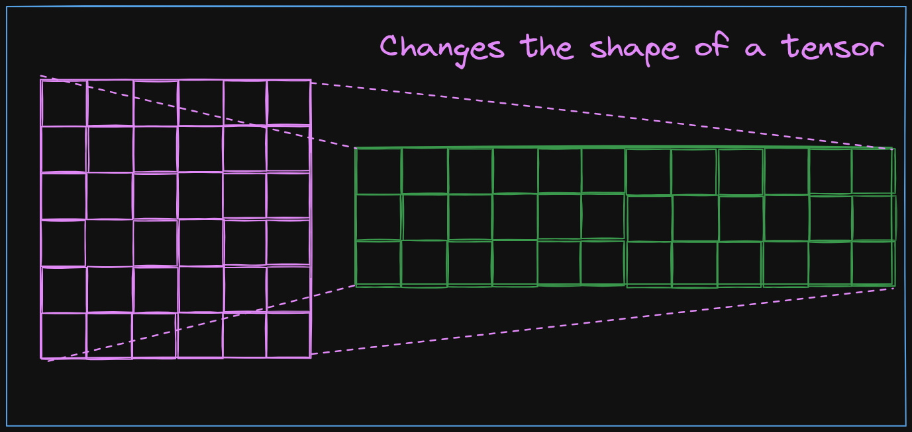

You can use the layers by importing them from `keras`:
```python
tf.keras.layers.<Layer>()
```

### Dense Layer
A [`dense`](https://www.tensorflow.org/api_docs/python/tf/keras/layers/Dense) layer connects every neuron from the previous layer with the next layer.


### `Conv1D`,`Conv2D`,`Conv3D`, `Conv4D`
The [`convolutional`](https://www.tensorflow.org/api_docs/python/tf/keras/layers/Conv1D) layer takes a kernel of the image and calculates it with weights. With this way you get a new image with special weights.

Options:

- `kernel_size`, how large the kernel should be




## `MaxPool1D`, `MaxPool2D`, `MaxPool3D`, `MaxPool4D`
The [`MaxPooling2D`](https://www.tensorflow.org/api_docs/python/tf/keras/layers/MaxPooling2D) layer reduces the size of the input data by keeping the maximum value in each group of values.

Options:

- `pool_size`, how large the pool/kernel should be to get the highest number



## `Flatten`

The [Flatten](https://www.tensorflow.org/api_docs/python/tf/keras/layers/Flatten) layer in a neural network transforms the input (most-likely a multi-dimensional array) into a one-dimensional array.


## `Dropout`
A [`dropout`](https://www.tensorflow.org/api_docs/python/tf/keras/layers/Dropout) layer randomly deactivates a fraction of input neurons during training, this prevents overtraining.


## `BatchNormalization`
A [`BatchNormalization`](https://www.tensorflow.org/api_docs/python/tf/keras/layers/BatchNormalization) layer normalizes activations in mini-batches, enhancing training stability and approach speed.
-> Each value has the same significance


## `GlobalMaxPooling1D`,`GlobalMaxPooling2D`,`GlobalMaxPooling3D`
[Global Max Pooling](https://www.tensorflow.org/api_docs/python/tf/keras/layers/GlobalMaxPooling1D) is a pooling operation that takes the maximum value across all spatial locations.


## `Reshape`
Changes the form of a tensor.


